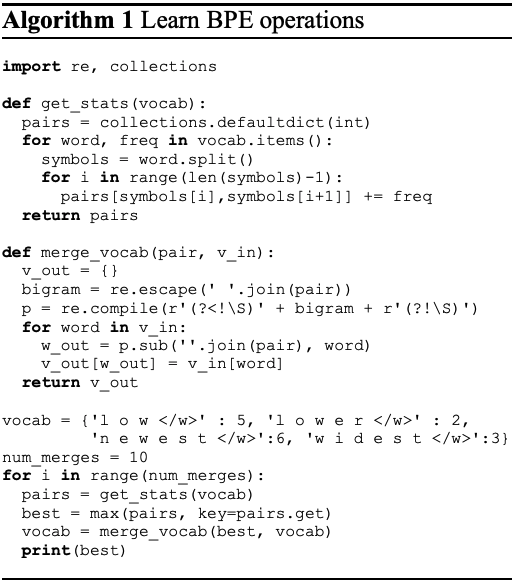

# Notes:

> Byte Pair Encoding (BPE) (Gage, 1994) is a simple data compression technique that iteratively replaces the most frequent pair of bytes in a sequence with a single, unused byte.
1. Initialize character vocabulary + EOW symbols
2. Count all symbol pair s and replace reach occurrence of the most frequent pair (A, B) into AB; new symbol introduces a new symbol which represents an n-gram
3. Merge frequent words 

 

so basically 
1. count the frequency of each pair
2. add the most freqeunt pair to the vocab
3. keep doing that for *n* times

## Making the tokenizer
1. Train
2. Encode
3. Decode
